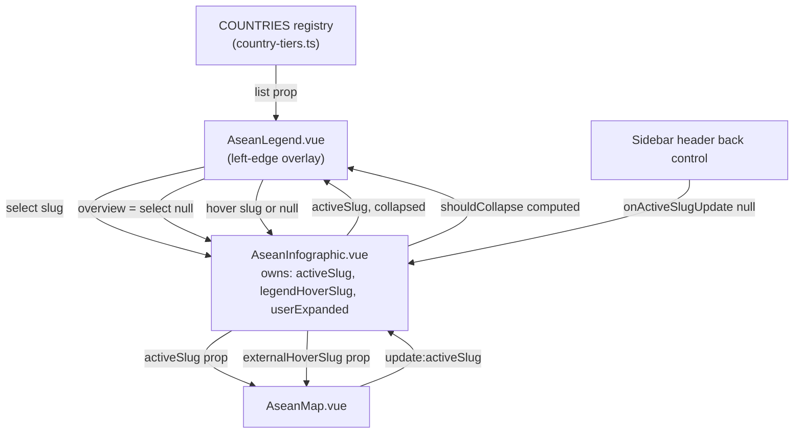
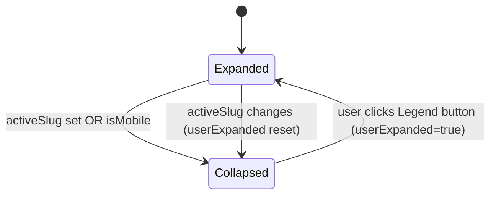

# feat: ASEAN map — A1 floating country legend + A2 back-to-map navigation (BF-76)

## Summary

Two map-navigation fixes from the Jun 25 Marshall review, design resolved in the 6/29 brainstorm:

- **A1 — Floating country legend (click-to-zoom):** a floating menu over the left-edge ocean listing all 11 ASEAN countries (flag + name). Clicking a row docks that country (reuses the existing dock choreography); hovering highlights it on the map (reuses the existing hover overlay). The menu collapses to a small "Legend" button when it would overlap land, and restores when there is room.
- **A2 — Back to full map (both placements):** an "Overview / Full map" entry pinned at the top of the legend (also reachable from the collapsed button), plus a dedicated back control in the focused sidebar header. Both null `activeSlug`, which already restores the calibrated idle frame.

This is a stacked branch off `feature/BF-78-reframe-map-north` so the legend collapse threshold is tuned against the BF-78 reframed idle defaults (`frameTx -1237, frameTy -335, frameScale 2.0`).

**Product Contract preservation:** product scope defined by the BF-76 brief; no upstream brainstorm doc to diff against. Scope unchanged.

---

## Problem Frame

After the BF-78 reframe, country selection still has two usability gaps surfaced in the Jun 25 review:

1. **Tiny countries are unclickable.** Singapore, Brunei, and Timor-Leste are too small to hit reliably by pixel-hunting on the map. There is no list-based affordance to select them.
2. **No discoverable way back to the overview.** The only way to deselect today is to re-click the active country on the map — undocumented and easy to miss.

Both are navigation affordances layered on top of the existing `AseanMap` / `AseanInfographic` selection model, which already supports `activeSlug` (controlled), hover highlight, dock re-zoom, and idle-frame restore on `activeSlug = null`.

---

## Requirements

- **R1** — A floating legend lists all 11 ASEAN countries (flag + name), anchored at the left edge over the ocean. Source of truth is the `COUNTRIES` registry in `data/asean/country-tiers.ts`.
- **R2** — Clicking an interactive country row (tier `inScope` or `stretch`) docks that country: sets `activeSlug`, reusing the existing dock re-zoom + sidebar choreography.
- **R3** — Hovering a country row highlights that country on the map, reusing the existing map hover overlay.
- **R4** — `inert` countries (Myanmar, Timor-Leste) render in the legend but are non-interactive (disabled, reduced opacity, `aria-disabled`) until A3 / BF-79–80 wire their profiles.
- **R5** — The legend collapses to a small "Legend" button when it would overlap land (heuristic: when a country is docked, i.e. `activeSlug != null`, and on narrow viewports). Expanding the button reopens the full list and overrides collapse until the next dock.
- **R6** — An "Overview / Full map" entry pinned at the top of the legend nulls `activeSlug` (returns to the idle full map). Reachable both from the expanded list and from the collapsed-button state.
- **R7** — A dedicated back control in the focused sidebar header nulls `activeSlug`, accessible label "Back to full map".
- **R8** — Keyboard + ARIA: legend is a navigable list of buttons; disabled rows are not focusable activation targets; the back control and overview entry are real buttons. Reduced-motion is respected (inherited from existing transitions).

**Done when:** all 11 countries are reachable via the legend; tiny countries are selectable without pixel-hunting; the legend collapses to a button when it would overlap land and restores when there is room; from a focused country the user can return to the full map via either the menu's Overview entry or the in-panel back control.

---

## Key Technical Decisions

- **New presentational component `components/asean/AseanLegend.vue`, rendered by `AseanInfographic.vue` (not inside `AseanMap`).** The legend lives in the infographic's fixed-overlay coordinate space at the left edge, so it sits in normal DOM (not SVG viewBox space) and emits intent up. `AseanMap` stays focused on rendering + the map's own hit-testing. Rationale: the legend is a chrome affordance, not part of the map plate; keeping it out of the SVG avoids viewBox-coordinate math and lets it use normal CSS positioning + flex.

- **Hover wiring via a new `externalHoverSlug` prop on `AseanMap` (lift-and-merge), not an exposed method.** `AseanInfographic` owns a `legendHoverSlug` ref, passes it into `AseanMap` as `externalHoverSlug`, and `AseanMap` merges it with its internal `hoverSlug` (internal map hover wins when both are set, so direct map interaction is never overridden). Rationale: declarative prop reuses the existing hover overlay + typewriter label path with no imperative coupling; matches the existing controlled-`activeSlug` pattern. Only `inScope`/`stretch` slugs resolve to a `hoveredFeature` (inert have no interactive feature), so inert hover is a no-op on the map — acceptable and consistent with R4.

- **Collapse heuristic is a single `shouldCollapse` computed, no land-geometry detection.** Per the brief, a viewport/threshold heuristic suffices. `shouldCollapse = (activeSlug != null) || isMobile`. When a country is docked the map reframes into the top-left quadrant — exactly when the left-edge legend would overlap the docked landmass — so docked-state collapse is the core rule, and `isMobile` (from the existing `useViewport`, ≤879px) handles narrow viewports. A user-initiated expand sets a `userExpanded` ref that overrides collapse until `activeSlug` changes again (watch resets it). Rationale: one rule covers both the focused dock and the A4 reframe without DOM measurement.

- **Legend uses flag emoji from the registry, not flag images.** The `COUNTRIES` registry carries `flag` emoji; the sidebar's flag *images* (`flagUrl`) live in the profiles data. The brief specifies "flag + name" for compact rows — emoji is the lighter, registry-native choice and needs no per-country image asset.

- **Overview entry and back control both call the existing `onActiveSlugUpdate(null)`.** No new reset logic: `frameStyle` in `AseanMap` already restores the idle calibrated frame when `activeFeature` is null. Rationale: reuse the single source of truth; avoid a second frame-reset path that could drift from the BF-78 defaults.

- **Country ordering in the legend follows registry insertion order, grouped implicitly by tier presence.** Interactive countries (inScope, stretch) render normally; inert render disabled at the bottom of their natural order. No re-sort — registry order is the designed order.

---

## High-Level Technical Design

State ownership and data flow after this change:

Collapse decision:

---

## Implementation Units

### U1. `AseanLegend.vue` presentational component

**Goal:** A self-contained left-edge legend listing all 11 countries with an Overview entry, emitting `select` / `overview` / `hover`, and rendering either the full list or a collapsed "Legend" button based on a `collapsed` prop.

**Requirements:** R1, R2, R3, R4, R6, R8.

**Dependencies:** none (presentational; consumes the registry directly).

**Files:**
- `components/asean/AseanLegend.vue` (create)

**Approach:**
- Props: `activeSlug: string | null`, `collapsed: boolean`.
- Emits: `select(slug: string)`, `overview()`, `hover(slug: string | null)`, and `expand()` (clicked the collapsed button).
- Import `COUNTRIES` from `~/data/asean/country-tiers`; derive an ordered array `Object.values(COUNTRIES)`. Compute `isInteractive = tier === 'inScope' || tier === 'stretch'`.
- Expanded render: a vertical menu anchored left (`position: absolute; left; top; transform: translateY(-50%)` centered vertically over the ocean band). Pinned first row = "Overview / Full map" button (emits `overview`). Then one button per country: `{{ flag }} {{ name }}`. Interactive rows emit `select(slug)` on click, `hover(slug)` on mouseenter, `hover(null)` on mouseleave. Inert rows are `<button disabled aria-disabled="true">` with reduced opacity and no hover emit. Mark the active country row with an `is-active` class + `aria-current="true"`.
- Collapsed render: a single small "Legend" pill button that emits `expand()` on click. It still exposes the Overview action — simplest: clicking the collapsed button expands the list (which contains Overview pinned at top), satisfying "Overview reachable from the collapsed button" via one extra click. (Keep it to one control; do not duplicate Overview into the collapsed pill.)
- Styling: glassmorphism consistent with the existing sidebar tabs (`background: rgba(2,38,64,0.5)`, `backdrop-filter: blur(12px)`, `border: 1px solid rgba(255,255,255,0.1)`, rounded). `pointer-events: auto` on the legend root (it sits inside the pointer-events:none infographic overlay region — opt back in like `.asean-infographic__tabs`). Font `'Encode Sans'`.
- Reduced motion: any expand/collapse transition wrapped so it is disabled under `prefers-reduced-motion`.

**Patterns to follow:** the glass tablist in `components/infographics/AseanInfographic.vue` (`.asean-infographic__tabs` / `.asean-infographic__tab`) for surface + button styling and the `pointer-events: auto` opt-in pattern.

**Test scenarios:**
- Renders 11 country rows + 1 Overview row when `collapsed=false`. (Covers R1, R6)
- Interactive rows (inScope/stretch) emit `select` with the correct slug on click. (Covers R2)
- Inert rows (`myanmar`, `timor_leste`) render `disabled` / `aria-disabled` and emit no `select` on click. (Covers R4)
- Mouseenter on an interactive row emits `hover(slug)`; mouseleave emits `hover(null)`. (Covers R3)
- Overview row emits `overview`. (Covers R6)
- When `collapsed=true`, only the "Legend" pill renders (no list rows); clicking it emits `expand`. (Covers R5)
- The row matching `activeSlug` carries `is-active` / `aria-current`.

**Verification:** mounting the component with each `collapsed` value renders the expected DOM; emitted events fire with correct payloads; inert rows are inert.

---

### U2. `AseanMap` accepts `externalHoverSlug` and merges it into the hover overlay

**Goal:** Allow a parent to drive the map's hover highlight from outside (the legend), reusing the existing hover overlay + typewriter label, without overriding direct map hover.

**Requirements:** R3.

**Dependencies:** none (independent of U1; wired together in U3).

**Files:**
- `components/asean/AseanMap.vue` (modify)

**Approach:**
- Add optional prop `externalHoverSlug?: string | null` (default `null`).
- Introduce a resolved hover slug computed: internal `hoverSlug` wins when set, else `externalHoverSlug`. Repoint `hoveredFeature` (and the `watchEffect` pause-animations guard + the `hover-layer` `v-if` slug comparison) at this resolved value rather than the raw `hoverSlug` ref.
- The typewriter `watch(hoveredFeature, ...)` is unchanged in shape — it now reacts to externally-driven hovers too, which is the desired effect (legend hover types the country name on the map label).
- Inert slugs resolve to no `hoveredFeature` (not in `interactiveFeatures`), so legend-hovering an inert row is a benign no-op on the map.

**Patterns to follow:** the existing controlled-`activeSlug` resolution (`const activeSlug = computed(() => props.activeSlug ?? internalActiveSlug.value)`) — mirror that precedence shape for hover, but with internal taking precedence over external (direct interaction wins).

**Test scenarios:**
- With no internal hover, setting `externalHoverSlug` to an interactive slug renders the hover overlay for that country. (Covers R3)
- Internal map hover takes precedence: when both internal `hoverSlug` and `externalHoverSlug` are set to different countries, the internally-hovered country's overlay renders.
- `externalHoverSlug` set to an inert slug renders no hover overlay (no `hoveredFeature`).
- Clearing `externalHoverSlug` to `null` removes the externally-driven overlay.

**Verification:** existing internal hover behavior is unchanged; external prop drives the overlay only when internal hover is absent.

---

### U3. Wire the legend into `AseanInfographic` and add the in-panel back control

**Goal:** Render `AseanLegend` in the infographic, own `legendHoverSlug` + `userExpanded` state, compute `shouldCollapse`, wire `select`/`overview`/`hover`/`expand`, pass `externalHoverSlug` into `AseanMap`, and add the "Back to full map" control to the sidebar header.

**Requirements:** R2, R3, R5, R6, R7, R8.

**Dependencies:** U1, U2.

**Files:**
- `components/infographics/AseanInfographic.vue` (modify)

**Approach:**
- Add state: `const legendHoverSlug = ref<string | null>(null)`; `const userExpanded = ref(false)`; bring in `useViewport()` for `isMobile`.
- `shouldCollapse` computed: `(activeSlug.value != null || isMobile.value) && !userExpanded.value`.
- Reset override: `watch(activeSlug, () => { userExpanded.value = false })` so a new dock re-collapses the legend (R5).
- Render `<AseanLegend :active-slug="activeSlug" :collapsed="shouldCollapse" @select="onActiveSlugUpdate" @overview="onActiveSlugUpdate(null)" @hover="legendHoverSlug = $event" @expand="userExpanded = true" />`. Place it as a sibling of `<AseanMap>` / the intro / sidebar, inside `.asean-infographic` (the fixed overlay).
- Pass `:external-hover-slug="legendHoverSlug"` into `<AseanMap>`.
- Add the back control to the sidebar `<header class="asean-infographic__title">`: a `<button type="button" aria-label="Back to full map" @click="onActiveSlugUpdate(null)">` near the identity block (e.g., a small "← Full map" pill above or beside the flag/name). Style consistent with the tabs; `pointer-events: auto` already applies via the header chrome (verify — add if the header itself is click-through).
- `onActiveSlugUpdate(null)` already restores idle (frame resets in `AseanMap`), so no extra reset code.

**Patterns to follow:** the existing `@update:active-slug="onActiveSlugUpdate"` wiring on `<AseanMap>`; the `.asean-infographic__tabs` `pointer-events: auto` opt-in for clickable chrome inside the click-through sidebar.

**Test scenarios:**
- Legend `select(slug)` updates `activeSlug` and docks the country (drives the existing dock path). (Covers R2)
- Legend `hover(slug)` sets `legendHoverSlug`, which flows to `AseanMap` `externalHoverSlug` and highlights the country. (Covers R3)
- `shouldCollapse` is `true` when `activeSlug != null` and `false` at idle on a wide viewport; `true` when `isMobile`. (Covers R5)
- Clicking the collapsed legend button sets `userExpanded=true` → `shouldCollapse` becomes `false` (list reopens) even while docked. (Covers R5)
- Selecting a new country resets `userExpanded` to `false` (re-collapses). (Covers R5)
- Legend Overview entry and sidebar back control both set `activeSlug` to `null`, returning to the idle full map and restoring the calibrated frame. (Covers R6, R7)
- Back control has `aria-label="Back to full map"`. (Covers R7, R8)

**Verification:** clicking each country in the legend docks it; tiny countries (Singapore, Brunei, Timor-Leste) are reachable from the list; both return paths restore the idle map; legend collapses on dock and restores via the pill.

---

## Scope Boundaries

In scope: the floating legend, click-to-zoom, hover-to-highlight, collapse-to-button heuristic, Overview entry, and the in-panel back control.

Out of scope:
- Wiring profiles for `inert` countries (Myanmar, Timor-Leste) — that is A3 / BF-79–80; here they render disabled.
- Real land-geometry overlap detection — the brief explicitly accepts a viewport/threshold heuristic.
- The BF-78 reframe itself (this branch is stacked on it).

### Deferred to Follow-Up Work
- When BF-79–80 land, flip the inert rows to interactive by data alone (no legend code change expected — `isInteractive` derives from tier) and verify.

---

## Verification Contract

- All 11 countries appear in the expanded legend; clicking any interactive row docks that country.
- Singapore, Brunei, and Timor-Leste are reachable from the legend without map pixel-hunting (Timor-Leste remains disabled until BF-79–80; reachable = visible in list).
- Hovering a legend row highlights the matching country on the map.
- The legend collapses to a "Legend" pill when a country is docked (and on ≤879px viewports) and restores to the full list at idle or when the pill is clicked.
- From a focused country, both the legend Overview entry and the sidebar back control return to the idle full map and restore the BF-78 calibrated frame.
- `npx nuxi typecheck` (or the repo's typecheck script) passes; no console errors in the browser.
- Reduced-motion: no animation regressions with `prefers-reduced-motion: reduce`.

## Definition of Done

- U1–U3 implemented; all listed test scenarios covered.
- Verification Contract satisfied in the browser at desktop and a narrow viewport.
- Typecheck/lint clean; PR opened against `feature/BF-78-reframe-map-north`.
